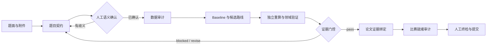

# Math Modeling Adversarial Skill

面向 CUMCM、MCM/ICM 等数学建模竞赛的证据门控型 Codex Skill。它把题意确认、数据审计、多路线求解、独立验证、结果追踪、论文证据和提交前检查连接成可执行工作流。

[三分钟跑通](docs/QUICKSTART.md) | [完整复现](README_REPRODUCE.md) | [契约规范](references/problem_contract.md) | [常见问题](docs/TROUBLESHOOTING.md) | [资料权利说明](NOTICE.md)

> 仓库与 Skill 标识保留 `math-modeling-adversarial-v43` 以兼容既有安装；当前公开实现已经演进至 V44 工作流。旧 V38/V43 入口仍用于历史 benchmark 和兼容回归。

## 为什么做这个 Skill

数学建模最危险的错误往往不是模型不够复杂，而是题意、数据、指标、约束或论文数字在流程中悄悄错位。本 Skill 的核心原则是：

- 数值结论必须绑定题目契约、输入数据、执行代码和可重算证据。
- baseline 与候选路线必须在相同信息条件下比较。
- 语言模型的判断不能覆盖机器门控失败。
- 自动化无法确认的领域语义必须交还给参赛队人工确认。
- 单个模型跑通不代表整场比赛已经可以提交。

## 核心能力

| 模块 | 能力 | 关键产物 |
| --- | --- | --- |
| 题目契约 | 明确输入、输出、单位、指标方向、约束、假设与歧义 | `problem_contract.json` |
| 数据审计 | 检查文件、sheet、列、类型、缺失、合并单元格与数据哈希 | `data_audit.json`、数据体检报告 |
| 多路线求解 | 执行 baseline、候选、消融与专用路线 | adapters、实验日志、registry |
| 原生题型 | 预测、回归、评价、线性/MILP、网络流、ODE、仿真、空间 IDW、零售决策 | 结构化指标与验证结果 |
| 证据门控 | 检查 contract、execution、evidence、validation、domain constraints | `final_judge.json` |
| 多问题 DAG | 按依赖关系执行分析、预测、优化、仿真、敏感性和论文节点 | workflow summary |
| 论文证据 | 将关键陈述与 JSON path、CSV selector、单位和证据哈希绑定 | claim registry、结果章节 |
| 比赛就绪 | 审计逐问答案、fallback、时间、风险、复跑、合规和提交物 | `competition_readiness.json` |
| 独立审查 | 支持求解者、质询者、修正者与裁判的隔离工作流 | 多 Agent 审查记录 |

## 工作流



这条链路刻意把“代码执行成功”“模型结果可接受”和“整套参赛材料可提交”分成不同判定，避免把一个绿色日志误当成完整结论。

## 安装

```powershell
git clone https://github.com/fxzsa0293-pixel/math-modeling-adversarial-v43.git
Copy-Item -Recurse .\math-modeling-adversarial-v43 "$HOME\.codex\skills\math-modeling-adversarial-v43"
cd "$HOME\.codex\skills\math-modeling-adversarial-v43"
python -m venv .venv
.\.venv\Scripts\python -m pip install -r tools\requirements-dev.txt
```

也可以直接把仓库克隆到 `$HOME\.codex\skills\math-modeling-adversarial-v43`。重新启动 Codex 或开启新任务后，可用 `$math-modeling-adversarial-v43` 显式调用；Skill 也允许在匹配的数学建模请求中自动触发。

运行环境需要 Python 以及 `tools/requirements.txt` 中的科学计算依赖。公开包已在当前 V44 Windows 环境完成全量验证；其他操作系统建议先运行下方最小示例，再决定是否执行耗时较长的完整 benchmark。

## 快速开始

### 三分钟验证安装

仓库自带一个 60 行预测样例，无需修改路径或准备外部数据：

```powershell
$env:PYTHONIOENCODING='utf-8'
.\.venv\Scripts\python tools\run.py --auto-solver `
  --problem-id quickstart_retail `
  --data-root examples\quickstart `
  --brief examples\quickstart\brief.md `
  --output-dir run\quickstart `
  --max-routes 6
```

完整的 Windows、macOS/Linux 命令、产物解释和换用自己题目的步骤见 [三分钟 Quickstart](docs/QUICKSTART.md)。

当前公开样例的实测摘要如下；不同依赖版本可能带来细微浮点差异：

```json
{
  "version": "v44",
  "adapter_count": 6,
  "executed_route_count": 6,
  "failed_route_count": 0,
  "verdict": "pass",
  "recommended_route": {
    "route_id": "regularized_lag_model",
    "metric": "MAE",
    "final_test_value": 10.622727,
    "final_test_improvement_vs_baseline": 0.696494
  }
}
```

这只说明示例的求解与证据链路成功，不表示任何真实赛题已经完成。

### 正式题目

先准备题目说明、数据目录与题目契约。正式比赛中，不要把自动推断的契约当成人工确认。

```powershell
cd tools
$env:PYTHONIOENCODING='utf-8'
python semantic_review_form.py create "D:\problem\problem_contract.json" "D:\problem\semantic_review.json"
# 队员填写语义复核表后，再运行 apply 生成确认版契约
python semantic_review_form.py apply "D:\problem\problem_contract.json" "D:\problem\semantic_review.json" "D:\problem\problem_contract.confirmed.json"
python contract_completeness.py "D:\problem\problem_contract.confirmed.json"
python run.py --auto-solver --problem-id problem-a --data-root "D:\problem\data" --brief "D:\problem\brief.md" --contract "D:\problem\problem_contract.confirmed.json"
```

多问题任务可声明 DAG：

```powershell
python run.py --workflow "D:\problem\workflow.json"
```

最终提交前运行比赛就绪审计。只有 `competition_readiness.json` 的 `verdict` 为 `READY`，机器检查才认为材料完整；人工视觉检查与官方规则确认仍不可省略。

## 按场景选择入口

| 你现在要做什么 | 推荐入口 | 说明 |
| --- | --- | --- |
| 确认安装是否正常 | [三分钟 Quickstart](docs/QUICKSTART.md) | 跑内置小数据，检查最短链路 |
| 解一道单问题赛题 | `tools/run.py --auto-solver` | 契约、审计、多路线、验证和结果导出 |
| 解相互依赖的多问赛题 | `tools/run.py --workflow` | 用 DAG 管理问题依赖、恢复执行和跨问证据 |
| 复现本地历史案例 | [完整复现说明](README_REPRODUCE.md) | 准备合法本地语料后运行 V38/V44 benchmark 和历史演练 |
| 做多 Agent 独立审查 | `scripts/run_multi_agent.py` | 角色隔离、质询、修正与裁判流程 |
| 检查提交材料 | `tools/competition_readiness.py` | 汇总契约、逐问答案、证据、时间与合规状态 |
| 出错或被门控拦截 | [常见问题与排错](docs/TROUBLESHOOTING.md) | 定位环境、契约、证据和授权问题 |

## 你会得到什么

一次 V44 自动求解通常生成如下工作区，而不是只打印一个分数：

```text
run/<problem>/
|-- summary.json
|-- judge/final_judge.json
|-- registry/experiment_registry.json
|-- experiments/
`-- competition_workspace/
    |-- problem/problem_contract.json
    |-- work/data_audit/data_audit.json
    |-- work/data_audit/数据体检报告.md
    |-- work/plan/求解计划.md
    `-- reports/
        |-- route_comparison.csv
        |-- result_summary.json
        `-- figure_requirements.md
```

`final_judge.json` 是核心机器判定：它记录每层门控是否通过、推荐路线、风险标记和下一步，而 `experiment_registry.json` 保存路线配置、输入哈希、代码哈希、指标与证据路径。论文中的关键数字应继续登记到 claim registry，不应从终端输出手工抄录。

## 本地资料与 benchmark

公开仓库不分发权利状态未核实的论文、赛题、附件、图纸或第三方源码。`data/reference_root/` 是被 Git 忽略的本地目录；用户可从官方或其他合法来源自行准备资料，用于个人研究和回归测试。资料策略见 [data/README.md](data/README.md)。

准备好对应的本地语料后，可运行历史 benchmark：

```powershell
cd tools
python run.py --self-contained
python run_v44_real_benchmarks.py
python run_v44_cross_archetype_benchmarks.py
```

这些命令所需的第三方输入不随公开仓库提供。历史案例只能证明技术链路，不代表对新赛题自动建模的正确性，也不能升级为正式比赛的 `READY` 证据。

## 验证

```powershell
python -m pip install -r tools\requirements-dev.txt
python -m pytest tools\tests -q
```

带完整合法本地语料的开发环境曾验证 `175 passed`，V38 历史 benchmark 为 11 个案例且 `gate.verdict=pass`。清洁公开克隆没有第三方语料，相关历史测试会明确跳过；Quickstart 与其余原创逻辑测试仍可直接运行。

## 版本关系

| 标识 | 角色 | 当前用途 |
| --- | --- | --- |
| V38 | 显式角色与自包含历史门控 | 兼容回归、11 个历史案例 benchmark |
| V43 | Mrite 工作区协议与 Skill 标识 | 保持安装路径和调用名兼容 |
| V44 | 当前实现 | 契约、数据装配、原生题型、多问题 DAG、证据与比赛就绪链路 |

仓库名中的 `v43` 是稳定标识，不表示代码停留在 V43。行为与产物版本以当前 `SKILL.md`、CLI 输出及 V44 文档为准。

## 仓库结构

```text
SKILL.md                 Agent 工作协议、能力边界与比赛门控
agents/openai.yaml       Codex UI 名称、简介与调用策略
references/              契约、多问题 DAG、多 Agent 与就绪审计说明
scripts/                 多 Agent 编排等辅助脚本
tools/                   CLI、求解器、验证器、审计器与测试
data/                    本地资料策略；reference_root 被 Git 忽略
examples/quickstart/     可直接运行的小型预测示例
docs/                    V1-V44 演进和交付说明
README_REPRODUCE.md       详细复现与命令说明
HANDOFF_CHECKLIST.md      交接检查清单
```

## 能力边界

- 通用 adapter 不能替代题目特定的机理、约束或领域验证。
- 多文件、多 sheet、目标含糊或单位不完整时，必须先补齐题目契约。
- 复杂优化、机理、时变仿真和三目标以上问题可能需要 specialist route。
- 自动生成的论文段落只能引用已绑定证据，不应凭空扩写数值结论。
- 竞赛规则可能变化，参赛队必须以当届官方规则为准。

## 常见误区

- `final_judge=pass` 不等于 `competition_readiness=READY`，前者判断当前求解证据，后者判断整场交付。
- 自动推断出 `status=ready` 不替代队员对指标方向、单位、约束、时间顺序和业务语义的确认。
- 历史 benchmark 证明已知案例上的链路可复现，不证明新题答案正确。
- 本地 `data/reference_root/` 不会在每次调用时全部装入上下文；Skill 按任务需要逐步读取说明和用户合法取得的资料。
- `--allow-specialist-code` 仅表示允许执行经过人工审查的专用脚本，不表示系统替你认可其来源或结论。

更多环境与运行问题见 [常见问题与排错](docs/TROUBLESHOOTING.md)。

## 资料与权利说明

公开仓库只提供项目自身的代码、说明、测试和自建示例，不打包分发权利状态未核实的第三方资料。用户放入本地 `data/reference_root/` 的内容不会被 Git 跟踪；详细规则见 [NOTICE.md](NOTICE.md) 与 [data/README.md](data/README.md)。

## 状态

这是研究与竞赛工程工具，不是无人值守的自动参赛系统。它的价值在于让建模过程更可核查、更容易发现失败，也让最后写进论文的每一个关键数字都有来处。
